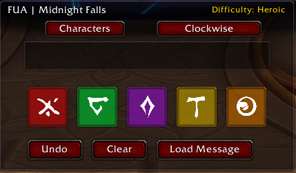
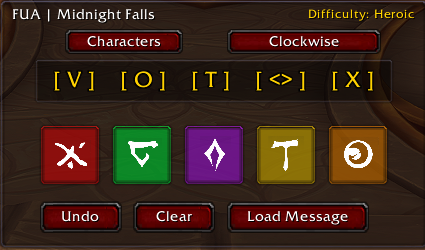
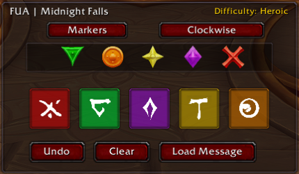

<p align="center">
  
</p>

# FUA



A lightweight World of Warcraft addon designed to assist with raid mechanics that require players to communicate a sequence of symbols.

FUA intentionally follows a simple, player-driven design philosophy. The addon helps players build and review a symbol order, then prepares a chat message for the player to send manually.

## Features

* Custom symbol buttons with visual icon support.
* Difficulty-aware symbol limits.

  * LFR / Normal: 3 symbols
  * Heroic / Mythic: 5 symbols
* Duplicate prevention.
* Clockwise and Counter Clockwise ordering.
* Character and Raid Marker output modes.
* Automatic message preparation.
* Automatic detection of raid leadership privileges.
* Optional encounter detection support.
* Lightweight UI with minimal screen impact.

## Design Philosophy

FUA is intentionally designed as an information and communication aid.

The addon does not:

* Automatically send chat messages.
* Automatically determine mechanic solutions.
* Automatically assign player positions.
* Automate gameplay decisions.

Instead, FUA provides a quick interface for players to record the symbol order they observe and prepares a message for review before the player manually sends it.

This approach keeps the addon simple, transparent, and aligned with Blizzard's addon restrictions.

## Usage

### Opening the Window

Type:

```text
/fua
```

Additional commands:

```text
/fua show
/fua hide
/fua clear
```

### Building an Order

1. Click each symbol as it appears.
2. Symbols may only be selected once.
3. The current sequence is displayed in the center panel.

### Direction Mode

The direction toggle switches between:

* Clockwise
* Counter Clockwise

This changes the displayed and prepared order to match different raid positioning preferences.

### Output Modes

#### Characters

Displays and prepares messages using shorthand notation:

```text
[ O ] [ T ] [ <> ] [ V ] [ X ]
```


#### Markers

Displays raid marker icons in the addon window and prepares the equivalent raid marker codes for chat:

```text
{rt2} {rt1} {rt3} {rt4} {rt7}
```


### Sending Messages

Due to Blizzard restrictions during the Lu'a encounter, addons cannot reliably open chat channels or automatically send raid messages.

FUA prepares the assignment message for you, but does not send it automatically.

To send a prepared assignment:

1. Open the chat channel you wish to use (Raid Warning, Raid, Instance, Party, etc.).
2. Build the rune order in FUA.
3. Click **Prepare Message**.
4. Copy the prepared text.
5. Close the prepared message window if needed.
6. Paste the message into chat.
7. Press **Enter** to send.

This workflow complies with Blizzard's restrictions while still allowing FUA to quickly generate accurate rune assignments during the encounter.


## Encounter Support

FUA can optionally detect specific encounters and automatically display the window when the encounter begins.

This functionality is intended only as a convenience feature and does not automate any gameplay actions.

## Compatibility

Current Version:

* World of Warcraft Retail
* Midnight

## Installation

1. Download the addon.
2. Extract the `FUA` folder into:

```text
World of Warcraft/_retail_/Interface/AddOns/
```

3. Restart World of Warcraft or type:

```text
/reload
```

4. Enable FUA from the AddOns menu.

## Planned Features

Future releases may include:

* Visual position assignment assistance.
* Automatic parsing of FUA-formatted raid messages.
* Shared encounter displays between players using FUA.
* Additional encounter support.

## About the Name

FUA is the name of a line of location software I develop professionally. During progression raiding, I adapted the concept to solve a much different problem: helping players quickly communicate where they need to be during mechanics.

The idea grew out of a simple question frequently asked during progression:

"Where the f* are you supposed to be at?"

The acronym has since taken on a life of its own.

## Credits

Created by Mezcal.

Inspired by the need for a clean, lightweight method of communicating raid symbol sequences while keeping the player in control of all final actions.
