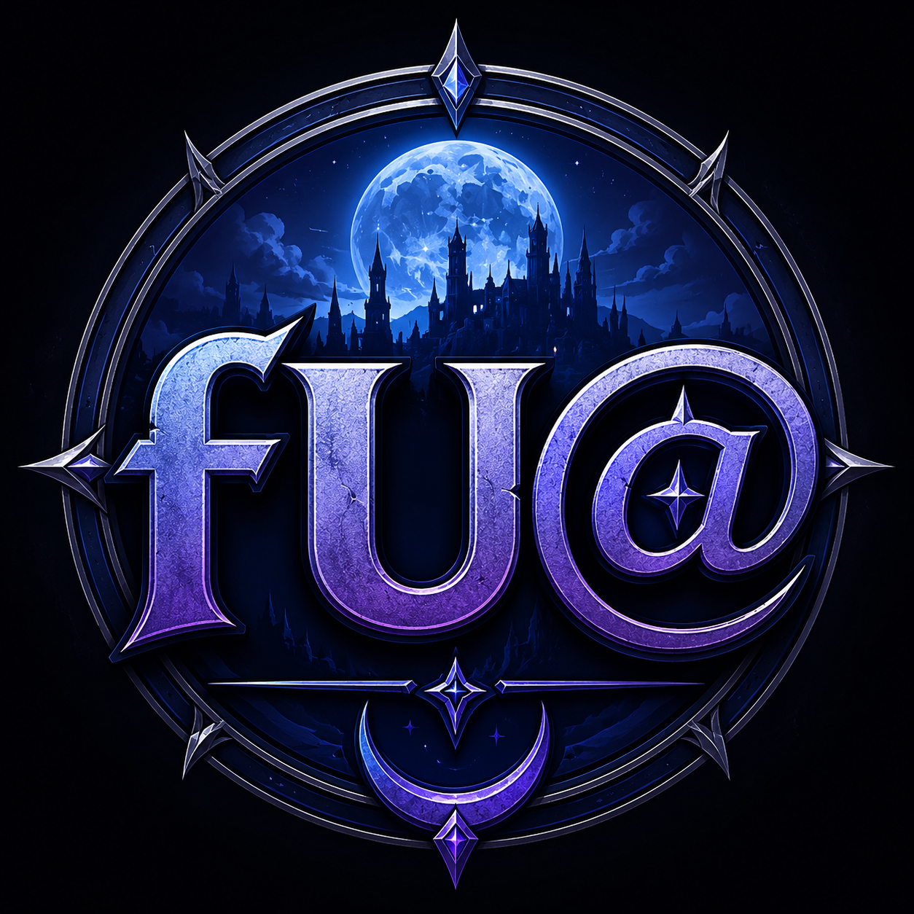
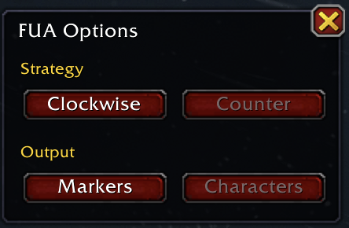
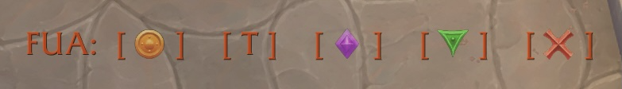
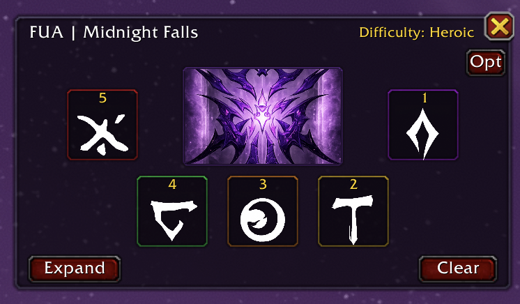

<p align="center">
  
</p>

# FUA


A lightweight World of Warcraft addon designed to assist with raid mechanics that require players to communicate a sequence of symbols.

FUA intentionally follows a simple, player-driven design philosophy. The addon helps players build and review a symbol order, then prepares a chat message for the player to send manually.

## Features

* Custom symbol buttons with visual icon support.
* Difficulty-aware symbol limits.
  * LFR / Normal: 3 symbols
  * Heroic / Mythic: 5 symbols
* Duplicate prevention.
* Clockwise and Counter Clockwise ordering for strategy.
* Character and Raid Marker output modes.
* Automatic message preparation.
* Encounter detection support.
* Compact (collapsed) diagram mode.
* Encounter diagram with visual position assignments.
* Dynamic difficulty-aware position layouts.
* Visual rune assignment tracking with L'ura positioning.
* Persistent UI settings.
* Dedicated options panel.
* Lightweight UI with minimal screen impact.
* Multi-language localization support.
  * English
  * Spanish
  * Portuguese
  * German
  * French
  * Italian

## Design Philosophy

FUA is intentionally designed as an information and communication aid.

The addon does not:

* Automatically send chat messages.
* Automatically determine mechanic solutions.
* Automatically assign player positions.
* Automate gameplay decisions.

Instead, FUA provides a quick interface for players to record the symbol order they observe and prepares a message for review before the player manually sends it.

This approach keeps the addon simple, transparent, and aligned with Blizzard's addon restrictions.

## Usage

### Opening the Window

Type:

```text
/fua
```

Additional commands:

```text
/fua show
/fua hide
/fua clear
/fua help
```

### Building an Order

1. Click each symbol as it appears.
2. Symbols may only be selected once.
3. The current input sequence is displayed in the feedback panel.
4. The encounter diagram updates automatically to show final player positions.

### Options Direction Mode



The direction toggle switches between:

* Clockwise
* Counter Clockwise

This changes the encounter positioning strategy used by the visual diagram and prepared message output.

The feedback display continues to show the symbols in the order they were entered.

### Output Modes

#### Characters

Displays and prepares messages using shorthand notation:

```text
[ O ] [ T ] [ <> ] [ V ] [ X ]
```


#### Markers

Displays raid marker icons in the addon window and prepares the equivalent raid marker codes for chat:

```text
{rt2} {rt1} {rt3} {rt4} {rt7}
```


### Sending Messages

Due to Blizzard restrictions during the L'ura encounter, addons cannot reliably open chat channels or automatically send raid messages. If these restrictions are lifted, then the addon will send messages. Otherwise, FUA prepares the assignment message for you to send manually.

To send a prepared assignment:

1. Build the rune order in FUA.
2. Click **Prepare Message**.
3. Review the generated message in the chat edit box.
4. Press **Enter** to send.

FUA never sends chat messages automatically. The player remains responsible for reviewing and sending all communications.

This workflow complies with Blizzard's restrictions while still allowing FUA to quickly generate accurate rune assignments during the encounter.

Note: Additional steps need to be taken to post the message to the raid or raid warning. Prepare Message opens the generated assignment in the chat edit box for review. The player is responsible for selecting the desired chat channel and sending the message.

There are a few ways to do this, find one that you like. Outside macros are king.

## Encounter Support

FUA can optionally detect specific encounters and automatically display the window when the encounter begins.

This functionality is intended only as a convenience feature and does not automate any gameplay actions.

### Encounter Protection

Assignment imports are only accepted while the Midnight Falls encounter is active.

### Compact Diagram Mode

Players who only need to view assignments may collapse the interface into a compact diagram-only mode.

Collapsed mode displays:

* Encounter diagram
* Expand button
* Quick Clear button



This significantly reduces screen space usage during progression attempts.

## Compatibility

Current Version:

* World of Warcraft Retail
* Midnight

## Installation

1. Download the addon.
2. Extract the `FUA` folder into:

```text
World of Warcraft/_retail_/Interface/AddOns/
```

3. Restart World of Warcraft or type:

```text
/reload
```

4. Enable FUA from the AddOns menu.

## Localization

FUA automatically uses the language of your World of Warcraft client.

Currently supported:

- English
- Spanish
- Portuguese
- German
- French
- Italian

Missing translations or corrections are welcome.

## Planned Features

Future releases may include:

* Additional encounter support.
* Expanded assignment import capabilities.
* Additional diagram and strategy tools.
* Enhanced localization support.

## About the Name

FUA is the name of a line of location software I develop professionally. During progression raiding, I adapted the concept to solve a much different problem: helping players quickly communicate where they need to be during mechanics.

The idea grew out of a simple question frequently asked during progression:

"Where the f* are you supposed to be at?"

The acronym has since taken on a life of its own.

## Credits

Created by Mezcal.

Inspired by the need for a clean, lightweight method of communicating raid symbol sequences while keeping the player in control of all final actions.
